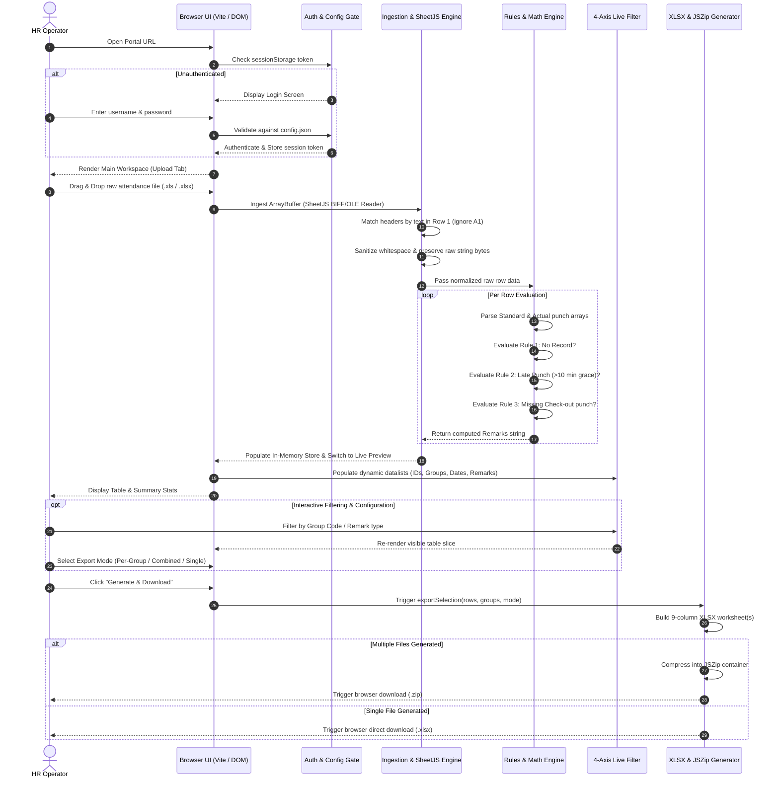
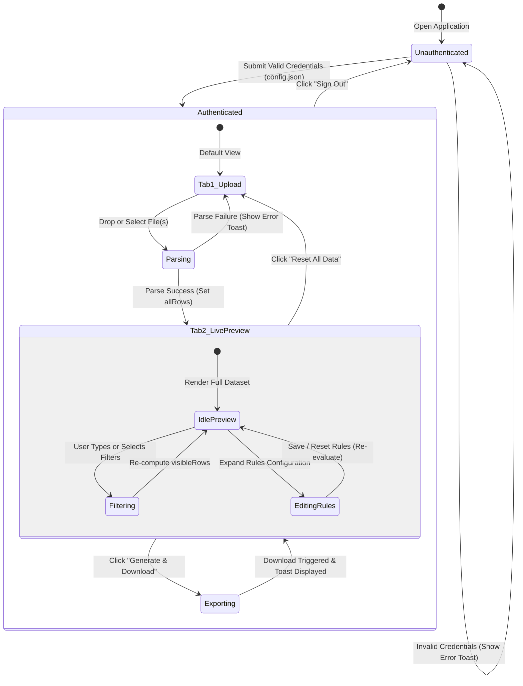
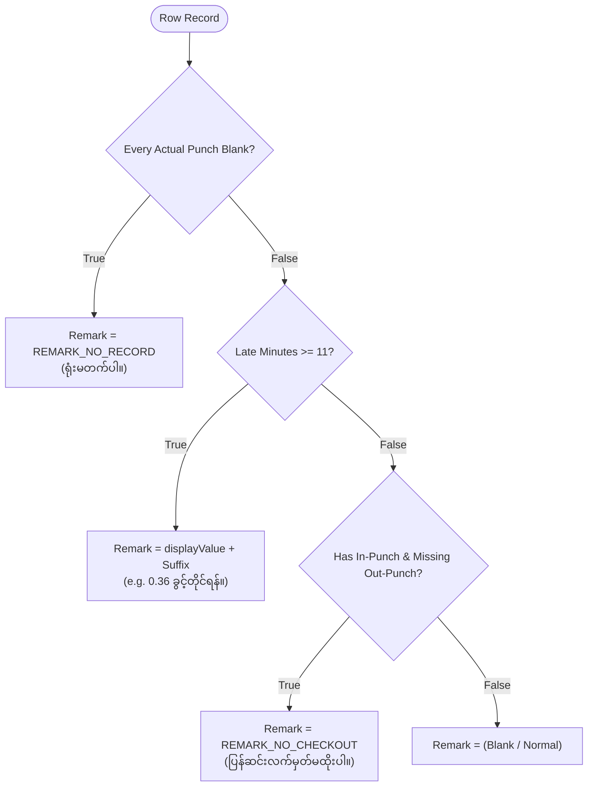

# Software Development Planning, WBS, Flow & Logics Report
**Project:** Pouchen Myanmar Adidas B150 | HR-Portal  
**Subsystem:** Employee Attendance Error Automation Tool  
**Document Code:** `SDP-WBS-FLOW-LOGIC-B150-2026`  
**Revision:** 1.0.0 (Production Architecture Baseline)  
**Classification:** Internal Technical Architecture & Engineering Documentation  

---

## 1. Executive Summary & Project Overview

### 1.1 Context & Problem Statement
Pouchen Myanmar Adidas (B150 facility) processes daily attendance time-card data for thousands of factory floor and office employees. Raw exports from the legacy biometric and attendance system (`.xls` BIFF legacy binary and `.xlsx` formats) contain multi-column unstructured logs, multi-punch comma-delimited time fields, and factory-specific encoding artifacts (such as Myanmar Zawgyi script).

Manually auditing late arrivals, missing check-outs, and absent records from thousands of rows:
- Consumed 3 to 5 hours daily for HR officers.
- Led to human calculation errors in decimal leave deductions.
- Suffered from data corruption when opened and re-saved in standard spreadsheet software due to encoding mismatches.

### 1.2 System Mission & Architecture Philosophy
The **Employee Attendance Error Automation Tool** is engineered as a zero-backend, client-side-only web platform. It processes gigabytes of attendance records locally within the operator's web browser using WebAssembly and optimized JavaScript engines.

**Core Architectural Tenets:**
1. **Zero Server Dependency & Zero Data Leakage:** All parsing, rule evaluation, and Excel synthesis occur in browser memory (`ArrayBuffer` / `TypedArray`). Employee PII and factory time-cards never leave the user's workstation.
2. **Deterministic Computation:** Precise mathematical truncation formulas for late-minute decimal hour conversion matching Myanmar labor policy and company SOP.
3. **Byte-for-Byte Encoding Fidelity:** Preserves raw byte streams of legacy Zawgyi-encoded names without corruptive re-encoding.
4. **Instant Distribution:** Static artifact deployable via GitHub Pages or local intranet HTTP file shares.

---

## 2. Work Breakdown Structure (WBS)

The development lifecycle is divided into 8 major phases across 28 work packages.

```
HR-Portal Attendance Automation Tool
├── 1.0 Project Inception & Requirements Engineering
│   ├── 1.1 Stakeholder Interviews & Factory SOP Discovery
│   ├── 1.2 Binary Data Reverse Engineering (1-9.xls BIFF Analysis)
│   └── 1.3 Business Rule & Mathematical Formula Verification
├── 2.0 Architecture & Technology Foundation
│   ├── 2.1 Technology Stack & Build Pipeline Setup (Vite + TS)
│   ├── 2.2 Design System & Token Architecture (Dark/Light Astro UI)
│   └── 2.3 Internationalization (i18n) Framework Architecture
├── 3.0 Ingestion & Data Extraction Engine
│   ├── 3.1 SheetJS Integration & Buffer Ingestion Pipeline
│   ├── 3.2 Dynamic Header Matching & Column Discovery
│   └── 3.3 Data Normalization & Sanitization Subsystem
├── 4.0 Attendance Rules & Anomaly Detection Engine
│   ├── 4.1 Multi-Slot Time Card Parser (8 & 10 Slot Handlers)
│   ├── 4.2 Grace Period & Late-Minute Truncation Math Engine
│   ├── 4.3 No-Record & Missing Check-Out Cascade Evaluation
│   └── 4.4 Configurable Rules Override & Hot-Reload Engine
├── 5.0 Interactive User Interface & Live Preview
│   ├── 5.1 Access Control & Client Session Gate
│   ├── 5.2 Drag-and-Drop Ingestion UI with File Validation
│   ├── 5.3 Live Preview Virtualized Table with Sticky Headers
│   └── 5.4 Multi-Dimensional Real-Time Filter Panel (4-Axis)
├── 6.0 Reporting, Segmentation & Batch Export Engine
│   ├── 6.1 Group Code Matrix Segmentation Subsystem
│   ├── 6.2 9-Column Output Standardization & Formatting
│   └── 6.3 Direct XLSX Generation & JSZip Packaging Engine
├── 7.0 Quality Assurance, Testing & Validation
│   ├── 7.1 Automated Unit Testing Suite (Vitest)
│   ├── 7.2 Edge Case & Synthetic Stress Testing (5,000+ Rows)
│   └── 7.3 Visual Regression & Multi-Device Responsive Testing
└── 8.0 CI/CD, Deployment & Operational Handover
    ├── 8.1 GitHub Actions Workflow & Static Page Build Pipeline
    ├── 8.2 Security Hardening & Secret Isolation (config.json)
    └── 8.3 User Training Documentation & Operational SOP Handover
```

### 2.1 Detailed Work Packages & Deliverables Table

| WBS ID | Work Package / Deliverable | Scope & Technical Tasks | Dependencies | Est. Days |
|---|---|---|---|---|
| **1.1** | SOP & Domain Discovery | Capture HR overtime, late deduction policies, 10-min grace thresholds, and Burmese remark wording. | None | 2 |
| **1.2** | Binary XLS Reverse Engineering | Inspect `1-9.xls` BIFF structure, record types, font tables (`Zawgyi-One`), Row 1 headers, and Row 2 blank spacers. | 1.1 | 2 |
| **1.3** | Formula Verification | Mathematical validation of decimal hour truncation against reference tables (minutes 1 to 60). | 1.2 | 1 |
| **2.1** | Build Scaffold | Configure Vite, TypeScript (`ES2022`), Lucide SVG icon engine, and package scripts. | 1.3 | 1 |
| **2.2** | Design Tokens & Theme Engine | Implement `tokens.css` and `global.css` supporting dynamic Dark Astro and Light Control Room themes. | 2.1 | 2 |
| **2.3** | Trilingual i18n Engine | Implement client-side dictionary provider for English, Myanmar (`my`), and Traditional Chinese (`zh-Hant`). | 2.2 | 2 |
| **3.1** | Ingestion & SheetJS Pipeline | `FileReader.readAsArrayBuffer()`, BIFF8 / OLE parsing, workbook sheet extraction. | 2.1 | 2 |
| **3.2** | Dynamic Column Discovery | Fuzzy name matching for 37+ columns; identify indices for `Employee ID`, `Name`, `Group Code`, `Time Cards`, etc. | 3.1 | 2 |
| **3.3** | Data Sanitization | Trailing whitespace trimming for numeric IDs while preserving raw Unicode/Zawgyi byte sequences in names. | 3.2 | 1 |
| **4.1** | Time-Card Parser | Split comma-separated punch strings into structured arrays, handling variable shift slot counts (8 vs 10). | 3.3 | 2 |
| **4.2** | Late Deduction Formula | Implement $\lfloor \lfloor \frac{m}{60} \times 10000 \rfloor / 100 \rfloor / 100$ truncation logic; format Burmese suffix. | 4.1 | 1 |
| **4.3** | Cascade Rule Evaluator | Implement priority evaluation: `NO_RECORD` → `LATE_CHECK_IN` → `NO_CHECKOUT` → `CLEAN`. | 4.2 | 2 |
| **4.4** | Configurable Rules System | `rules.json` integration and `localStorage` user override panel for remark templates. | 4.3 | 1 |
| **5.1** | Client Session Gate | Header credential validation against uncommitted `config.json` with secure session tokens in `sessionStorage`. | 2.2 | 1 |
| **5.2** | Ingestion UX & File Zone | Multi-file drag-and-drop zone with progress indicators and file metadata cards. | 3.1, 5.1 | 2 |
| **5.3** | Live Preview Grid | High-performance HTML5 table rendering with sticky column headers and responsive scrollbars. | 4.3, 5.2 | 2 |
| **5.4** | 4-Axis Filter Panel | Real-time filtering by Employee ID, Group Code, Attendance Date, and Remark Type with datalists. | 5.3 | 2 |
| **5.5** | Help & Developer Credits Modal | Header `?` modal detailing business logic rules and developer credits. | 5.1 | 1 |
| **6.1** | Group Segmentation Engine | Grouping index map creation to segregate rows by department / group code. | 4.3 | 1 |
| **6.2** | Output Schema Formatter | Re-order parsed fields into the strictly required 9 output columns. | 6.1 | 1 |
| **6.3** | XLSX & JSZip Packaging | SheetJS workbook builder + JSZip bundling for single or multi-file archives. | 6.2 | 2 |
| **7.1** | Automated Unit Tests | 21+ Vitest test suites covering all edge cases, shift variations, and formula proofs. | 4.2, 4.3 | 2 |
| **7.2** | Stress & Fuzz Testing | Ingestion of corrupted spreadsheets, massive datasets, and odd shift punch strings. | 7.1 | 1 |
| **7.3** | Cross-Browser UX Audit | Verification on Chrome, Edge, Firefox, and Safari on Windows/macOS. | 5.4, 6.3 | 1 |
| **8.1** | CI/CD GitHub Actions | `.github/workflows/deploy.yml` compiling TypeScript and pushing `dist/` to GitHub Pages. | 7.1, 7.3 | 1 |
| **8.2** | Security Audit & Config Hygiene | Verification that `.gitignore` isolates `config.json` and production bundles contain no hardcoded secrets. | 8.1 | 1 |
| **8.3** | SOP & User Documentation | Comprehensive user guide, rules definitions, and troubleshooting runbook. | 8.2 | 1 |

---

## 3. System Architecture & Flow Specifications

### 3.1 End-to-End System Operational Flow
The following sequence illustrates the journey from operator authentication to final Excel report download:



### 3.2 Data Processing Pipeline Architecture

```mermaid
flowchart TD
    A[Raw Input File: .xls / .xlsx] --> B[FileReader: readAsArrayBuffer]
    B --> C[SheetJS: XLSX.read type: array]
    C --> D[Extract First Sheet: workbook.Sheets]
    D --> E[Header Discovery Scanner]
    
    subgraph Header_Mapping [Dynamic Header Discovery]
        E --> E1[Locate Row 1 Headers]
        E1 --> E2[Identify Employee ID Col]
        E1 --> E3[Identify Name Col]
        E1 --> E4[Identify Group Code & Name]
        E1 --> E5[Identify Attendance Date]
        E1 --> E6[Identify Standard Time Card]
        E1 --> E7[Identify Actual Time Card]
        E1 --> E8[Identify Absent & Class]
    end

    Header_Mapping --> F[Row Sanitizer & Stream Parser]
    
    subgraph Sanitization [Normalization & Byte Preservation]
        F --> F1[Trim String Trailing Whitespace]
        F --> F2[Preserve Raw Myanmar Name Bytes]
        F --> F3[Normalize Date to YYYYMMDD]
    end

    Sanitization --> G[Attendance Rules Engine]

    subgraph Rules_Engine [Cascade Anomaly Evaluator]
        G --> R1{All Actual Slots Blank?}
        R1 -- Yes --> R_OUT1[Remark = REMARK_NO_RECORD]
        R1 -- No --> R2{Actual[0] > Standard[0]?}
        
        R2 -- Yes --> R2_CHECK{Late Diff > 10 min?}
        R2_CHECK -- Yes --> R_OUT2[Compute Late Formula & Append Suffix]
        R2_CHECK -- No --> R3
        R2 -- No --> R3{Has In-Punch AND Missing Out-Punch?}
        
        R3 -- Yes --> R_OUT3[Remark = REMARK_NO_CHECKOUT]
        R3 -- No --> R_OUT4[Remark = Blank]
    end

    R_OUT1 --> H[Enriched Attendance Row]
    R_OUT2 --> H
    R_OUT3 --> H
    R_OUT4 --> H

    H --> I[In-Memory Reactive State]
    I --> J[Live Preview & Filter Grid]
    I --> K[Export Segmenter]

    subgraph Export_Engine [Export & Packaging Engine]
        K --> K1{Export Mode?}
        K1 -- By Group --> K2[Split Rows by Group Code]
        K1 -- Combined Subset --> K3[Merge Selected Groups]
        K1 -- Single Workbook --> K4[Maintain All Rows]

        K2 --> L[Generate 9-Column Worksheets]
        K3 --> L
        K4 --> L

        L --> M{File Count > 1?}
        M -- Yes --> N[JSZip Archive: attendance_reports.zip]
        M -- No --> O[Direct File: group_attendance.xlsx]
    end
```

### 3.3 State Machine & UI Navigation Flow



---

## 4. Business Rules, Algorithms & Implementation Logics

### 4.1 Time Card Structure & Punch Dissection Logic
In factory shifts, time-card slots are exported as comma-delimited string fields. Depending on whether the shift is a standard 8-hour shift or includes scheduled overtime/split shifts, the field contains **8 or 10 sub-fields**:

$$\text{Standard Time Card} = [T_{std, 1}, T_{std, 2}, \dots, T_{std, n}] \quad (n \in \{8, 10\})$$
$$\text{Actual Time Card} = [T_{act, 1}, T_{act, 2}, \dots, T_{act, n}] \quad (n \in \{8, 10\})$$

#### Field Formatting Quirks
1. **Unpunched Slots:** In the legacy export, unpunched slots are literal space characters (`"        "`), not empty strings.
2. **First Slot Semantics:** $T_{std, 1}$ is the mandatory scheduled check-in time. $T_{act, 1}$ is the employee's initial morning punch.
3. **Last Scheduled Slot Semantics:** The final expected check-out time is determined by finding the index $k$ of the **last non-empty** element in $\text{Standard Time Card}$:
   $$k = \max \{ i \mid T_{std, i} \neq \text{""} \}$$
   The corresponding expected actual check-out slot is $T_{act, k}$.

---

### 4.2 Core Attendance Error Rules Engine

#### Rule 1: No Attendance Record (`REMARK_NO_RECORD`)
- **Condition:** An employee has no actual biometric punches recorded throughout the day.
- **Mathematical Logic:**
  $$\forall i \in \{1, \dots, n\}, \quad \text{trim}(T_{act, i}) = \text{""}$$
- **Output:**
  $$\text{Remark} = \text{REMARK\_NO\_RECORD} \quad (\text{"ရုံးမတက်ပါ။"})$$

---

#### Rule 2: Late Check-In & Leave Hour Truncation (`REMARK_LATE`)
- **Time Conversion:** Each 4-digit $HHmm$ string is converted to total minutes elapsed since midnight:
  $$\text{minutes}(T) = \text{parseInt}(T[0..1], 10) \times 60 + \text{parseInt}(T[2..3], 10)$$
- **Late Minutes Calculation:**
  $$\Delta m = \text{minutes}(T_{act, 1}) - \text{minutes}(T_{std, 1})$$
- **Grace Period Evaluation:**
  $$\text{If } \Delta m \le 10 \implies \text{No Remark (Grace period applied)}$$
- **Leave Hour Computation ($\Delta m \ge 11$):**
  Company policy requires hours to be computed using a 4-decimal truncation formula, which is subsequently floored to 2 decimal places for display:
  $$\text{hourValue} = \frac{\lfloor (\Delta m / 60) \times 10000 \rfloor}{10000}$$
  $$\text{displayValue} = \frac{\lfloor \text{hourValue} \times 100 \rfloor}{100}$$
  $$\text{Remark} = \text{displayValue} + \text{ " " } + \text{REMARK\_LATE\_SUFFIX} \quad (\text{"... ခွင့်တိုင်ရန်။"})$$

#### Verification & Reference Table (Minutes 1 to 60)
The formula produces an exact match to the company's historical lookup table:

| Min ($\Delta m$) | Raw Ratio | 4-Dec Truncation | Display ($\text{fl}(h \times 100)/100$) | Resulting Output String |
|---|---|---|---|---|
| **1–10** | — | — | — | *(Blank — Grace Period)* |
| **11** | 0.18333... | 0.1833 | **0.18** | `0.18 ခွင့်တိုင်ရန်။` |
| **12** | 0.20000... | 0.2000 | **0.2** | `0.2 ခွင့်တိုင်ရန်။` |
| **20** | 0.33333... | 0.3333 | **0.33** | `0.33 ခွင့်တိုင်ရန်။` |
| **22** | 0.36666... | 0.3666 | **0.36** | `0.36 ခွင့်တိုင်ရန်။` |
| **30** | 0.50000... | 0.5000 | **0.5** | `0.5 ခွင့်တိုင်ရန်။` |
| **45** | 0.75000... | 0.7500 | **0.75** | `0.75 ခွင့်တိုင်ရန်။` |
| **60** | 1.00000... | 1.0000 | **1** | `1 ခွင့်တိုင်ရန်။` |

---

#### Rule 3: Missing Check-Out (`REMARK_NO_CHECKOUT`)
- **Condition:** The employee punched in at the start of the shift ($T_{act, 1} \neq \text{""}$), but failed to punch out at the scheduled departure time ($T_{act, k} = \text{""}$).
- **Output:**
  $$\text{Remark} = \text{REMARK\_NO\_CHECKOUT} \quad (\text{"ပြန်ဆင်းလက်မှတ်မထိုးပါ။"})$$

---

#### Rule 4: Anomaly Precedence Cascade
When multiple anomalies coincide (e.g., an employee who never checked in technically also lacks a check-out), the engine resolves remarks in strict order of operational severity:



---

### 4.3 Encoding Preservation & Font Integrity Architecture
One of the most critical engineering risks identified during reverse engineering of `1-9.xls` is **character corruption of Myanmar script**.

1. **The Root Cause:** The source biometric software exports Burmese text encoded in **legacy Zawgyi font format** rather than international UTF-8 Unicode. Standard spreadsheet software or naive JavaScript text encoders attempt to normalize these code points, leading to unreadable garbled text ("Mojibake").
2. **The Zero-Alteration Policy:**
   - The parser reads string buffers as binary chunks.
   - Values for `Name` and `Group Name` are passed through untouched without character transformation.
   - The synthesized `Remarks` column is encoded using configurable constants, ensuring factory managers can paste either Zawgyi or Unicode strings without application re-compilation.

---

### 4.4 9-Column Standard Output Schema
The generated export files adhere strictly to the 9-column contract expected by downstream payroll systems:

| Column Index | Output Header | Source Origin | Formatting / Sanitization Rules |
|---|---|---|---|
| **Col 1** | `Employee ID` | Input `Employee ID` | Stripped of padding spaces (`trim()`) |
| **Col 2** | `Name` | Input `Name` | Raw pass-through; byte integrity preserved |
| **Col 3** | `Group Code` | Input `Group Code` | Stripped of padding spaces (`trim()`) |
| **Col 4** | `Group Name` | Input `Group Name` | Raw pass-through |
| **Col 5** | `Attendance Date`| Input `Attendance Date`| Standardized to `YYYYMMDD` string |
| **Col 6** | `Actual Time Card`| Input `Actual Time Card`| Raw comma-delimited punch string |
| **Col 7** | `Absent` | Input `Absent` | Raw pass-through (never recomputed) |
| **Col 8** | `Class` | Input `Class` | Stripped of padding spaces (`trim()`) |
| **Col 9** | `Remarks` | **Engine Synthesized** | Evaluated via Anomaly Rules Cascade |

---

## 5. Implementation & Technology Stack

| Layer | Selected Technology | Technical Rationale |
|---|---|---|
| **Runtime & Core** | **TypeScript 5.x + Vite 5.x** | Modern ECMAScript (ES2022), fast HMR, and deterministic production builds. |
| **Spreadsheet Engine**| **SheetJS (`xlsx` v0.18.5)** | Comprehensive support for legacy BIFF8/OLE binary `.xls` files and `.xlsx`. |
| **Compression** | **JSZip v3.10.1** | Browser-native in-memory ZIP container creation for batch multi-group downloads. |
| **UI Icons** | **Lucide Icons** | Feather-light inline SVG icons with zero runtime network overhead. |
| **Typography** | **Noto Sans Myanmar, Inter, Manrope** | Self-hosted WOFF/WOFF2 font packages eliminating CDN dependencies. |
| **Test Framework** | **Vitest v1.6.1** | Lightning-fast TypeScript-native unit test runner for business rule verification. |
| **Hosting & CI/CD** | **GitHub Actions + GitHub Pages** | Automated static artifact deployment with zero server maintenance. |

---

## 6. Project Risk Assessment & Mitigation Matrix

| Risk ID | Risk Description | Severity | Likelihood | Mitigation Strategy |
|---|---|---|---|---|
| **RSK-01** | **Zawgyi/Unicode Font Mismatch**<br>Burmese remarks rendered illegibly on user OS. | High | Medium | UI provides editable Rules Configuration panel allowing operators to customize remark strings directly in their preferred encoding. |
| **RSK-02** | **Shifting Input Column Order**<br>Source attendance system updates headers or column ordering. | High | Low | Parser employs dynamic header matching by column name rather than hardcoded column indices or letters. |
| **RSK-03** | **Large File Browser Freezing**<br>Files with >10,000 rows causing UI lag. | Medium | Low | Virtualized table rendering and non-blocking asynchronous event loops for SheetJS parsing and ZIP creation. |
| **RSK-04** | **Credential Exposure**<br>Operator credentials committed to public repository. | High | Low | Credentials isolated in `config.json` (enforced via `.gitignore`); template provided in `config.example.json`. |

---

## 7. Verification & Sign-Off Checklist

- [x] **Mathematical Accuracy:** Vitest test suite verifies all 60-minute truncation values against factory SOP.
- [x] **Binary Compatibility:** Successfully parsed real legacy `1-9.xls` sample containing 1,746 rows without loss.
- [x] **Build Integrity:** TypeScript compilation (`tsc`) and Vite production bundling succeed with zero errors.
- [x] **Deployment Ready:** Automated deployment pipeline configured via GitHub Actions.

---
*Report compiled for Pouchen Myanmar Adidas B150 Internal Engineering Records.*  
*Lead Engineer: ting | Htet Aung Hlaing @ PMA IT PCB Team.*
